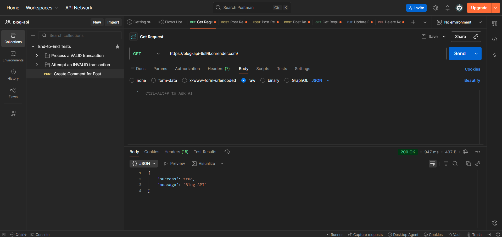
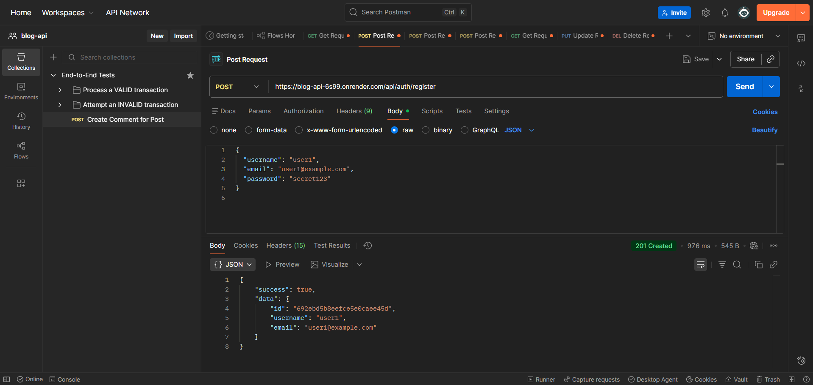
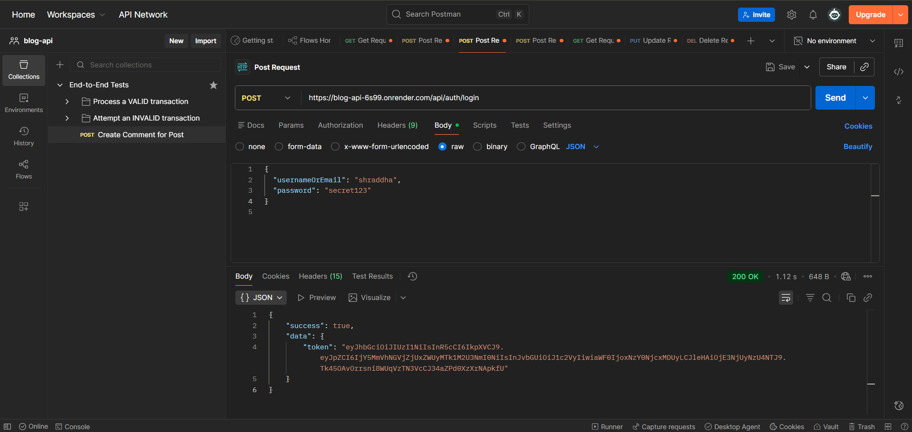
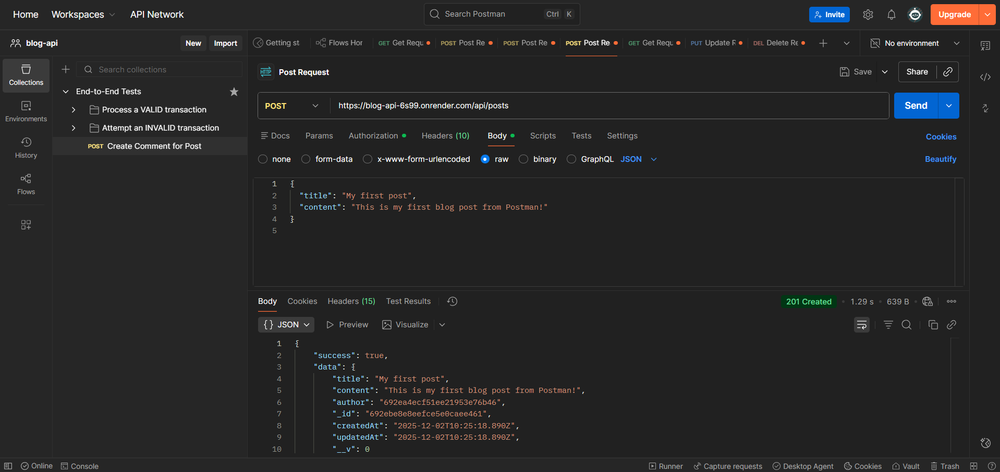

# Blog Application REST API

A full-featured RESTful Blog Backend built with Node.js, Express.js, MongoDB Atlas, and JWT authentication.  
This project allows users to register, log in, create blog posts, comment on posts, and perform full CRUD operations with secure access control.

---

## Features

### Authentication
- User Registration
- User Login
- Password hashing using bcrypt
- JWT-based authentication
- Protected routes

### Blog Posts
- Create a blog post
- Fetch all posts
- Fetch a single post
- Update your own post
- Delete your own post

### Comments
- Comment on posts
- Fetch all comments for a post
- Update your own comment
- Delete your own comment

### Database
- MongoDB Atlas (cloud)
- Mongoose models and schema validation

### Additional Features
- Error handling middleware
- Request validation
- Clean folder structure
- Docker support
- Environment variables using dotenv

---

## Tech Stack

- Node.js
- Express.js
- MongoDB Atlas
- Mongoose
- JWT Authentication
- Bcrypt
- Docker
- Postman (API Testing)
- Nodemon

---

## Project Structure

blog-api/
│── src/
│ │── controllers/
│ │── middleware/
│ │── models/
│ │── routes/
│ │── utils/
│ │── app.js
│ │── server.js
│
│── .env.example
│── docker-compose.yml
│── package.json
│── README.md

---

## Setup Instructions

### 1. Clone the repository

git clone https://github.com/
<your-username>/blog-api.git
cd blog-api

### 2. Install dependencies

npm install

### 3. Create a .env file

Inside project root, create a `.env` file:

PORT=4000
MONGO_URI=mongodb+srv://<username>:<password>@<cluster-url>/blogdb
JWT_SECRET=<your_secret_key>
JWT_EXPIRES_IN=7d
BCRYPT_SALT_ROUNDS=10

(Use `.env.example` for reference.)

---

## Run the Project

### Run locally (Recommended)

npm run dev

Server will start on:

http://localhost:4000/

Test:

http://localhost:4000/health

### Run using Docker

docker compose up --build

---

## API Testing (Postman)

Below are common API requests:

---

## Authentication APIs

### Register
POST /api/auth/register

Body:
{
"username": "user",
"email": "user@example.com",
"password": "secret123"
}

### Login
POST /api/auth/login

Body:
{
"usernameOrEmail": "user",
"password": "secret123"
}

### Login
POST /api/auth/login

Body:
{
"usernameOrEmail": "user",
"password": "secret123"
}

Response includes a token:

{
"success": true,
"data": {
"token": "eyJhbGc..."
}
}

Use the token for protected routes:
Authorization: Bearer <token>
---

## Blog Post APIs

### Create Post
POST /api/posts

Body:
{
"title": "My First Blog",
"content": "Hello world!"
}

Headers:
Authorization: Bearer <token>

### Get All Posts
GET /api/posts

### Get Single Post
GET /api/posts/:id

### Update Post
PUT /api/posts/:id

### Delete Post
DELETE /api/posts/:id

---

## Comment APIs

### Create Comment
POST /api/comments

Body:
{
"postId": "<post-id>",
"content": "Nice blog!"
}

Headers:
Authorization: Bearer <token>

### Get Comments for a Post
GET /api/comments?post_id=<post-id>

### Update Comment
PUT /api/comments/:id

### Delete Comment
DELETE /api/comments/:id

---

## Deployment

This project can be deployed on:

- Render (already hosted)
- Railway
- Vercel (serverless)
- AWS/GCP/Azure

Database is hosted on MongoDB Atlas.

---

## 📸 Screenshots

## 🌍 Live API

Base URL: `https://blog-api-6s99.onrender.com`

Example endpoints:
- `GET /` → `https://blog-api-6s99.onrender.com/`
- `GET /health` → `https://blog-api-6s99.onrender.com/health`
- `POST /api/auth/register` → `https://blog-api-6s99.onrender.com/api/auth/register`
- `POST /api/auth/login` → `https://blog-api-6s99.onrender.com/api/auth/login`
- `GET /api/posts` → `https://blog-api-6s99.onrender.com/api/posts`

## 🌍 Live Demo

- **Live API Base URL**: `https://blog-api-6s99.onrender.com`
- **Health Check**: `https://blog-api-6s99.onrender.com/health`

## 📚 API Documentation (Postman)

The complete API documentation (all endpoints, sample requests/responses) is available here:

👉 https://documenter.getpostman.com/view/45790366/2sB3dMwW2u

## Acknowledgements

This project is made as a learning-based backend development project for resumes, portfolios, and final year submissions.

